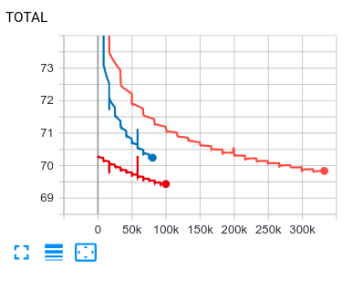
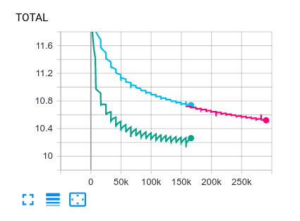

# README

## Installation

The whole training code for all this was written and saved as distinct package. To reproduce the code in the cells below please follow the installation guideline.

1. **[IMPORTANT]** Create new python environment with python3.6.9 and activate it.
2. Run the package installation command from the root of this repository. This command will install all the required packages from `requirements.txt` and the package `assignment1`.
```
pip install -e .
```
3. **[IMPORTANT]** Run all jupyter notebooks from the created environment
4. Load text file and upzip it to the `./data/` folder.
4. Load tensorboard logs (if you wish to see the loss plots) from [runs](https://drive.google.com/open?id=1NfLj-F3bsa2bTFfolVUz1gtNUiDbQ9nQ) and put them to the `./runs/` folder.
5. Load weights of the model from [models](https://drive.google.com/open?id=1NfLj-F3bsa2bTFfolVUz1gtNUiDbQ9nQ) and put them to the `./models/` folder.

## Manual tests

All commands should be runned from the terminal with active environment created on the `Installation` step.

1. Run `python assignment1/dataset.py` to test the Batcher creation.
2. Run `python assignment1/train.py --force_cpu --test_mode --test_size 10000` to test train loop of the vanilla SkipGram model on cpu (`--force_cpu`) using only first 10000 tokens from the data file.
3. Run `python assignment1/train.py --force_cpu --test_mode --negative_sampling` to test train loop of the SkipGram with Negative Sampling model.
4. Run `tensorboard --logdir runs/`, then open `http://localhost:6006/` in your browser to see original logs of word2vec training.
5. Run `python assignment1/word2vec.py` to check simplest analogy test on pretrained word vectors using reimplemented word2vec interface.

## Vanilla SkipGram

I've runned 2 experiments, but the second one was iterrupted in the middle of 10th epoch (freaking electricity issue). So I continued the second experiment from the last checkpoint - that's why I have 3 learning curves instead of 2 -_-

1. First experiment: I didn't get rid of the low-frequency words. The training command:
```
python assignment1/train.py --task_name vanilla_skipgram_zerou_mc_5 --batch_size 1024 --min_count 0 --num_workers 3 --num_epochs 20
```
One epoch lasted 41-42 minutes, total training took ~13.3 hours on Nvidia 1060 Max-Q GPU.
2. Second experiment: minimal frequency threshold was 5. The first training command:
```
python assignment1/train.py --task_name vanilla_skipgram_zerou_mc_5 --batch_size 2048 --num_workers 2 --num_epochs 20
```
The second training command:
```
python assignment1/train.py --task_name vanilla_skipgram_zerou_mc_5_ep9 --batch_size 2048 --num_workers 2 --num_epochs 12 --checkpoint models/vanilla_skipgram_zerou_mc_5/model_8.pth 
```
One epoch lasted 25.5 minutes, total training took ~8.5 hours on Nvidia 1060 Max-Q GPU.


The batch size for the second experiment is twice as big as that of the first experiment, so loss curves for the second experiment are in the different scale. You may investigate loss curves for positive and negative components of loss in tensorboard (`manual test 4`).



## SkipGram with Negative Sampling

I've runned 2 experiments, but wanted to see if the first will converge better after 20th epoch.

1. lr=1e-4, negative sampling in the loop
The first training command:
```
python assignment1/train.py --task_name neg_s_skipgram_zerou_mc_5 --batch_size 2048 --num_workers 2 --num_epochs 20 --negative_sampling
```
The second training command:
```
python assignment1/train.py --task_name neg_s_skipgram_zerou_mc_5_continue --batch_size 2048 --num_workers 2 --num_epochs 15 --negative_sampling --checkpoint models/neg_s_skipgram_zerou_mc_5/model_best.pth
```
One epoch lasted 14.1 minutes, total training took ~8.2 hours on Nvidia 1060 Max-Q GPU.

2. lr=1e-3, negative sampling in the BatcherNS class
Training command:
```
python assignment1/train.py --task_name neg_s_skipgram_zerou_mc_5_lr_0.001 --batch_size 2048 --num_workers 2 --num_epochs 20 --negative_sampling --lr 1e-3
```
One epoch lasted 28.6 minutes, total training took ~9.5 hours

Please investigate learning curves in tensorboard (`manual test 4`).



## Extra: extrinsic evaluation

The models were evaluated on `questions-words.txt` document with analogies.

|    | name                          |   total |     glove |     no_ns |     neg_s |
|---:|:------------------------------|--------:|----------:|----------:|----------:|
|  0 | : capital-common-countries    |     506 |         0 |         0 |         0 |
|  1 | : capital-world               |    4524 |         1 |         0 |         1 |
|  2 | : currency                    |     866 |         0 |         0 |         0 |
|  3 | : city-in-state               |    2467 |         1 |         2 |        11 |
|  4 | : family                      |     506 |        31 |        65 |        29 |
|  5 | : gram1-adjective-to-adverb   |     992 |         9 |         3 |         7 |
|  6 | : gram2-opposite              |     812 |         1 |        33 |         5 |
|  7 | : gram3-comparative           |    1332 |         0 |         0 |         1 |
|  8 | : gram4-superlative           |    1122 |         0 |         0 |         0 |
|  9 | : gram5-present-participle    |    1056 |        98 |        35 |        14 |
| 10 | : gram6-nationality-adjective |    1599 |         0 |         0 |         0 |
| 11 | : gram7-past-tense            |    1560 |       103 |        42 |        60 |
| 12 | : gram8-plural                |    1332 |       372 |        10 |        73 |
| 13 | : gram9-plural-verbs          |     870 |        28 |        23 |        19 |

The results are not that bad compating to the reference. The models:

* `glove` - glove-wiki-gigaword-200 embeddings from gensim zoo, reference model
* `no_ns` - vanilla_zerou_72k, vanilla model trained for 20 epochs with minimal frequency 5, window size 5
* `neg_s` - negative_sampling_lr1e-3, model with negative sampling trained for 20 epochs with minimal frequency 5, window size 5, number of negative samples 10.